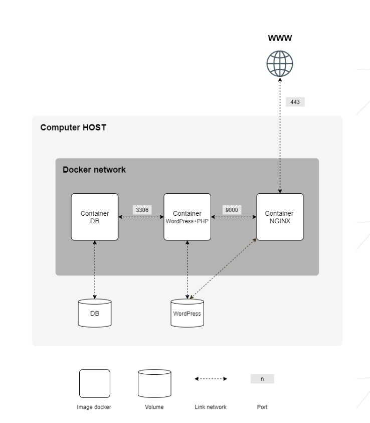

# 🏡 [PodereIlGufo](http://podereilgufo-jb2.pitunnel.com) Web Infrastructure

Welcome to the GitHub repository for the [PodereIlGufo](http://podereilgufo-jb2.pitunnel.com) real estate property's web infrastructure! This repository hosts the robust Docker-compose setup that orchestrates a trio of interconnected containers, each playing a vital role in delivering a seamless web experience.

## 📄 Overview

This architecture comprises three containers:

1. **Nginx Container**: Serves as the front-facing web server, efficiently handling client requests and serving static content with unparalleled speed and reliability.
2. **WordPress & PHP Container**: Powers dynamic content, providing a flexible and user-friendly interface for website management and blogging – all backed by the robust PHP processing.
3. **MariaDB (MySQL) Container**: The backbone of data storage, MariaDB offers a reliable and high-performance database solution, ensuring all website data is securely managed and readily accessible.

This infrastructure is the digital foundation of [PodereIlGufo](http://podereilgufo-jb2.pitunnel.com)'s online presence, showcasing property details, amenities, and other content essential for connecting with potential clients and the real estate community.

## 🚀 Getting Started

To deploy this infrastructure on your own system with your own rules, add a .env file at the root of the project with your variables and make sure you have your wordpress.sql file in the db folder; modify docker-compose.yml volumes section. Ensure you have also Docker and Docker-compose installed, clone this repository, and run:

```sudo make```

## 🌐 Visit PodereIlGufo Website

Click below to explore PodereIlGufo property and discover what makes PodereIlGufo Website so special:

👉 [Visit PodereIlGufo](http://podereilgufo-jb2.pitunnel.com).


## ⚙️ Features

- **Fully Containerized**: Each component of this web infrastructure is encapsulated in Docker containers, ensuring consistency, scalability, and ease of deployment.
- **Nginx Integration**: High performance and reliability of Nginx for serving static content and acting as a reverse proxy for WordPress site. This is the only container exposed to the outside world.


